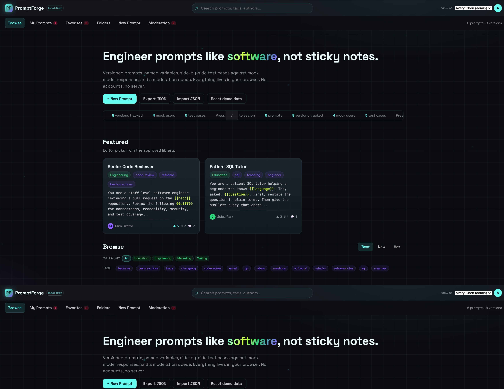
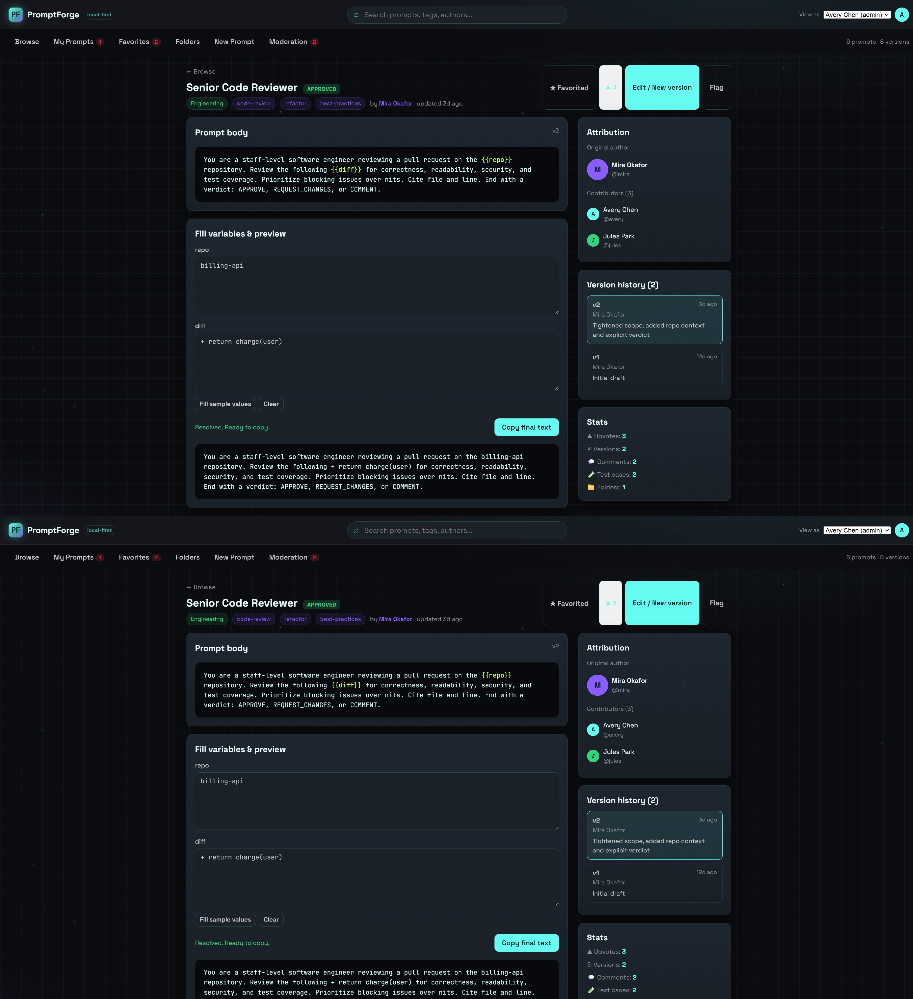
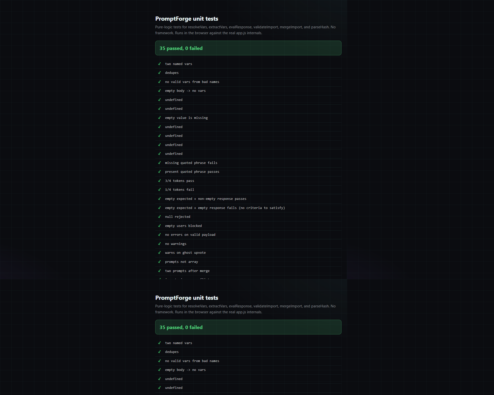

# Verificanda

A local-first, collaborative prompt-engineering platform. Versioned prompts, named variables, side-by-side test cases against mock model responses, and a moderation queue. No backend, no accounts. All data lives in your browser (IndexedDB).

## Screenshots

### Browse / discovery


### Prompt detail with variable fill, test-case table, version history, attribution


### Unit tests (35, framework-free)


## What it is

A working demo of a prompt library that treats prompts like software: tracked revisions (not overwrites), fill-in variables, a generated form, live preview, copy-with-validation, test cases comparing versions against mock model responses with real auto-eval, folders/favorites, import/export with validation, and a moderation workflow (draft / pending / approved / flagged).

## Run it

Zero dependencies, zero build step. Open `index.html` directly, or serve it:

```bash
npx serve .
# then open the printed URL
```

State persists in IndexedDB (`verificanda` database, `kv` store). The schema is versioned (`SCHEMA_VERSION`); a `migrate()` chokepoint handles future shape changes, and v0.1 localStorage data (under the prior project name) is imported once on first load. Use **Reset demo data** on the browse page to restore the original seed.

Run the unit tests by opening `tests.html` (35 tests, no framework, runs against the real `app.js` internals).

## Features

- **Data model:** prompts with title, body with `{{variables}}`, category, tags, author, version history, moderation state, upvotes, comments.
- **Browse / discovery:** featured prompts, category filters, tag filters, full-text search, Best / New / Hot sort tabs. Public browse shows only approved prompts.
- **Detail page:** body, variable fill form (auto-generated from the prompt), live resolved preview, one-click copy with inline missing-variable validation and on-button confirmation, version history, attribution panel (original author + contributors), comments, test-case table.
- **Editing workflow:** create prompts, submit revisions as new versions (previous bodies preserved), live preview while editing, seed sample test cases.
- **Organization:** folders/collections, favorites, tags, JSON import/export.
- **Testing layer:** per-prompt test cases (name, expected outcome, notes, variable inputs) with mock model responses shown side-by-side across versions. Verdicts auto-evaluate: quoted phrases in Expected must all appear in the response, and at least 60% of its significant words must match. Pills are clickable to override manually (unset / pass / fail).
- **Persistence:** IndexedDB with a schema-version field and a migration stub. Clear empty states for new users.
- **Moderation:** flag / approve / reject states visible to admins in a dedicated queue; non-approved prompts are hidden from public browse.
- **Mock accounts:** four client-side users (one admin). Switch with the "View as" selector in the top bar. No real auth.
- **Import validation:** imports are shape-validated; malformed files and empty user lists are refused before any state is touched.

## Architecture

Single-page app, vanilla JS, no framework, no dependencies. Files:

- `index.html` - shell
- `styles.css` - BERT dark theme + effects (CSSJS Effects Cookbook)
- `seed.js` - mock users + pre-seeded prompts, versions, comments, test cases
- `app.js` - state, IndexedDB persistence + schema migration, hash routing, all views, event delegation, eval logic
- `tests.html` + `tests.js` - framework-free unit tests for the pure logic

State is a single `db` object persisted to IndexedDB on every mutation. Routing is hash-based (`#/browse`, `#/prompt/:id`, `#/edit/:id`, `#/new`, `#/mine`, `#/favorites`, `#/folders`, `#/folder/:id`, `#/admin`).

Architecture overview (generated by GitDiagram): the SPA controller and router in `app.js` renders the four UI workflows (discovery/detail, authoring/versioning, moderation, organization), all backed by a single browser-persistence layer with schema migration. The test-case evaluation workflow stores verdicts back into the database; the data-exchange workflow validates and merges imported JSON. One caveat: the migration node is currently a stub (version-stamping only, no real shape change yet).

## Repurposing

The data model and views are domain-agnostic. The same shape (versioned items, variables, test cases, moderation) ports to any review-governed content library: runbooks, policies, eval datasets, or internal knowledge articles. Swap the seed and the category taxonomy.
